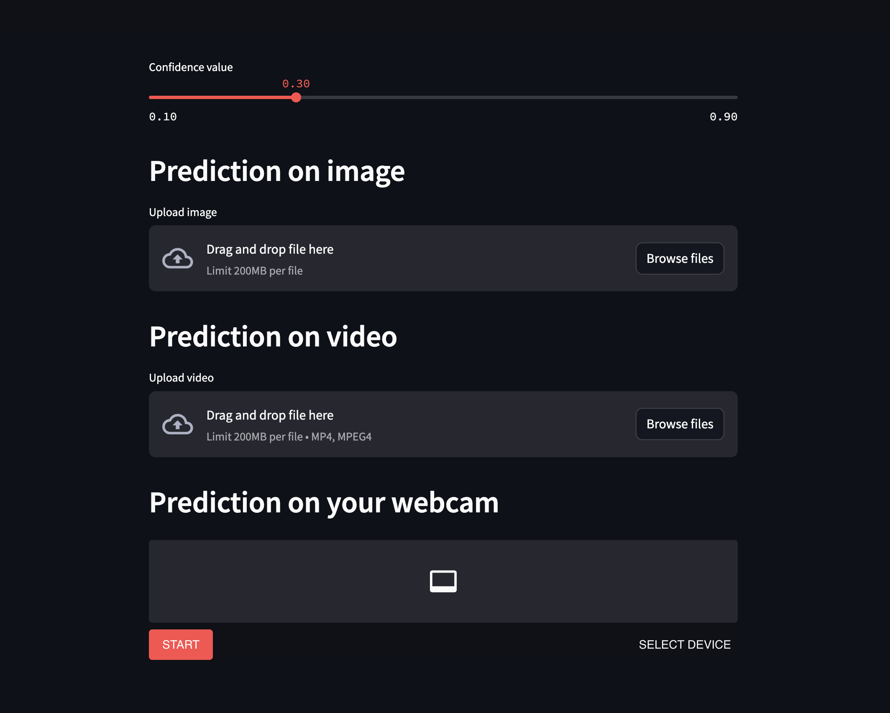
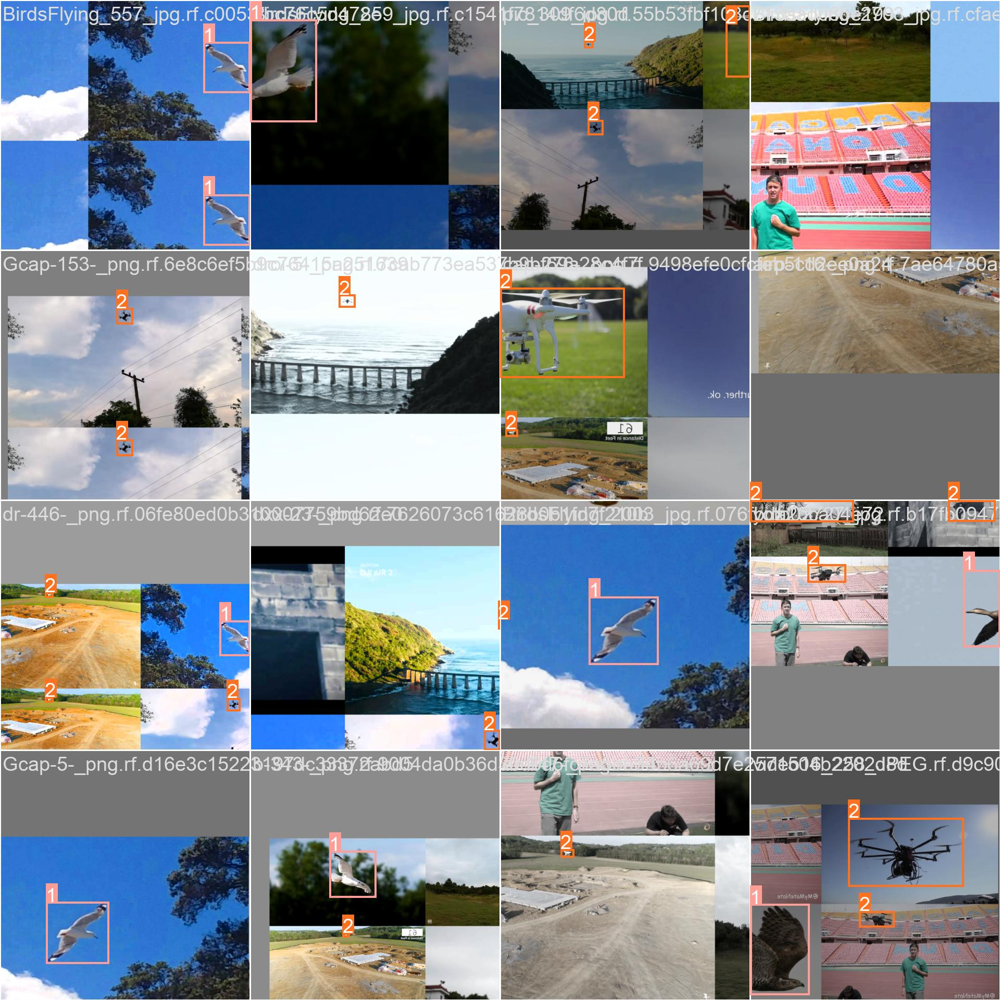
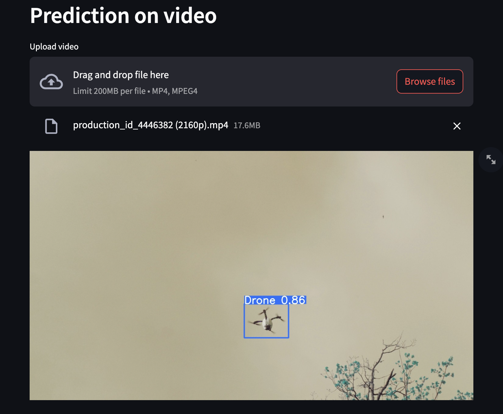

# Flying objects detection using YOLOv8

The project aims to detect flying objects such as drones, airplanes, birds and helicopters using the state-of-the-art YOLOv8 object detection algorithm. It also provides a simple streamlit application with the possibility of uploading an image, mp4 file or enabling a webcam.

We used [datasetdrone-trv98_dataset](https://universe.roboflow.com/project-ddrone/datasetdrone-trv98/dataset/29) published on [Roboflow](https://universe.roboflow.com/) for training.

It is possible to make predictions on images, videos and your webcam.

